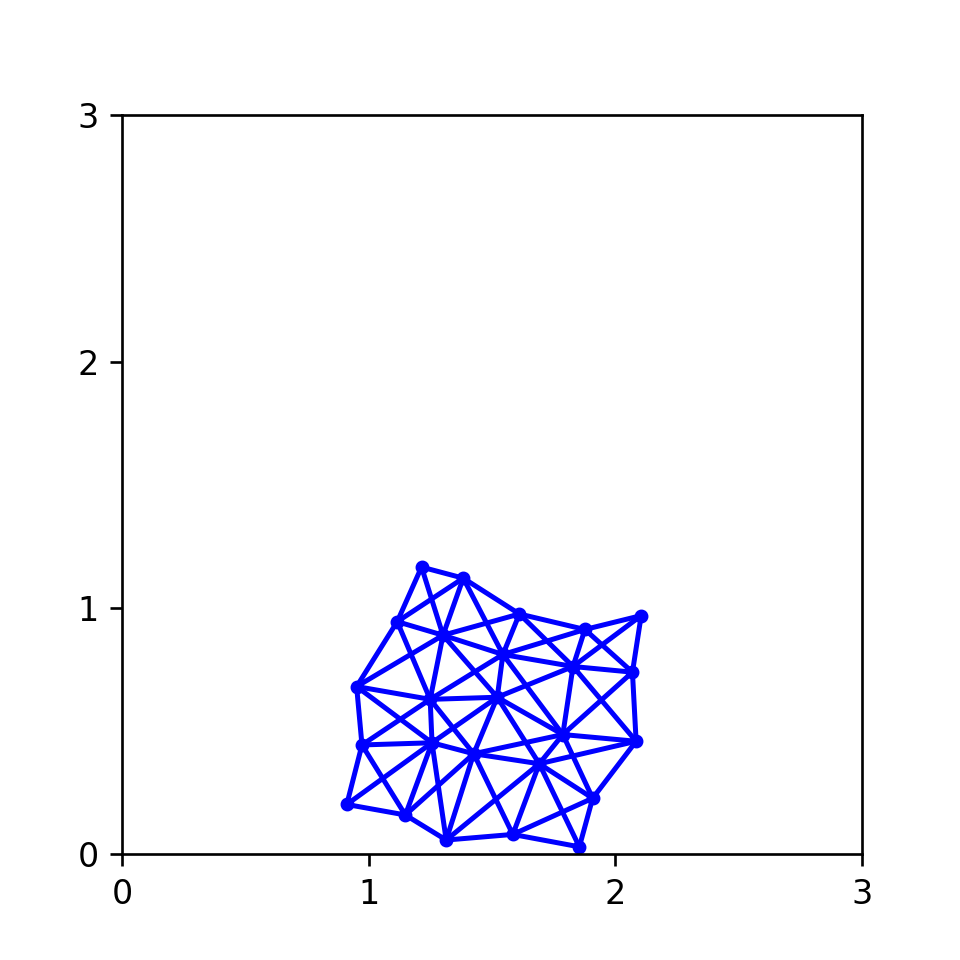

# springnetwork-python
Spring network code (Python)

## Create Your Own Spring Network Simulation (With Python)

### Philip Mocz (2021) Princeton University, [@PMocz](https://twitter.com/PMocz)

### [📝 Read the Algorithm Write-up on Medium](https://philip-mocz.medium.com/create-your-own-spring-network-simulation-with-python-d9246e4091e5)

Simulate a system of connected springs
with Hooke's Law

```
python springnetwork.py
```


